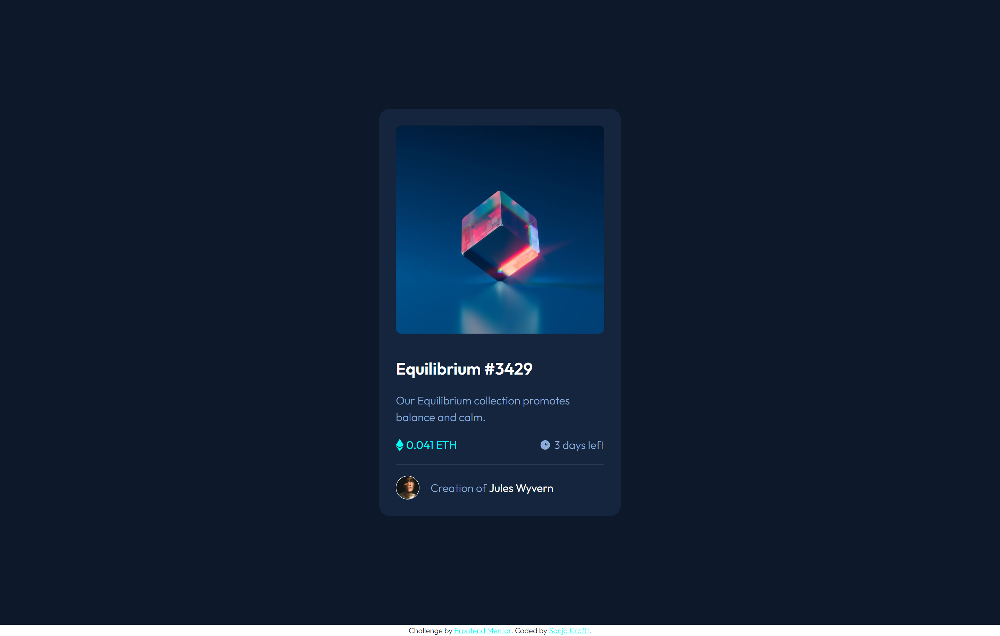

# Frontend Mentor - NFT preview card component solution

This is a solution to the [NFT preview card component challenge on Frontend Mentor](https://www.frontendmentor.io/challenges/nft-preview-card-component-SbdUL_w0U). Frontend Mentor challenges help you improve your coding skills by building realistic projects. 

## Table of contents

- [Overview](#overview)
  - [The challenge](#the-challenge)
  - [Screenshot](#screenshot)
  - [Links](#links)
- [My process](#my-process)
  - [Built with](#built-with)
  - [Useful resources](#useful-resources)
- [Author](#author)

## Overview

### The challenge

Users should be able to:

- View the optimal layout depending on their device's screen size
- See hover states for interactive elements

### Screenshot

### Links

- Live Site URL: [Add live site URL here](https://your-live-site-url.com)

## My process

### Built with

- HTML, SCSS, BEM, JS
- Mobile-first workflow
- Webstorm with Simple Hot Reload Server (install: `npm install -g simple-hot-reload-server`, start: `hrs`) and File Watcher with SCSS for building CSS

### Useful resources

- [BEM 101](https://css-tricks.com/bem-101/)
- [Battling BEM CSS: 10 Common Problems And How To Avoid Them](https://www.smashingmagazine.com/2016/06/battling-bem-extended-edition-common-problems-and-how-to-avoid-them/)
- [You Probably Need BEM CSS in Your Life (Tutorial)](https://www.youtube.com/watch?v=er1JEDuPbZQ)
- [Why I use the BEM naming convention for my CSS](https://www.youtube.com/watch?v=SLjHSVwXYq4)
- [CUBE CSS](https://piccalil.li/blog/cube-css)
- [Build a dashboard with CUBE CSS](https://piccalil.li/blog/build-a-dashboard-with-cube-css)
- [A look at the CUBE CSS methodology in action](https://www.youtube.com/watch?v=NanhQvnvbR8)
- [Learn to write better, resilient CSS](https://every-layout.dev/)
- [Scalable and Modular Architecture for CSS](https://smacss.com/book/)
- [Thinking in Atomic](https://acss.io/thinking-in-atomic.html)
- [ITCSS: Scalable and Maintainable CSS Architecture](https://www.xfive.co/blog/itcss-scalable-maintainable-css-architecture/)

## Author

- Github - [Sonja Krafft](https://www.github.com/sonmikrafft)
- Frontend Mentor - [@sonmikrafft](https://www.frontendmentor.io/profile/sonmikrafft)